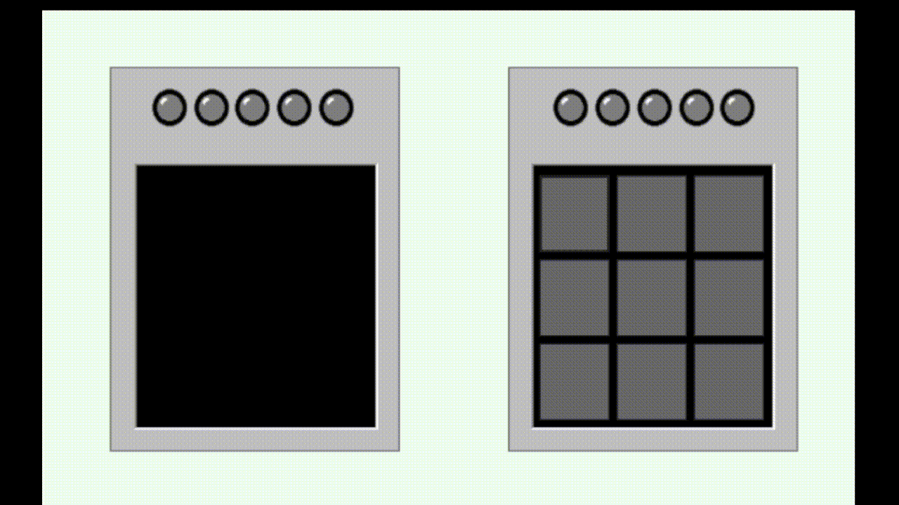

# Memory game
## Table of contents
* [Description](#description)
* [Overview](#overview)
* [Technologies](#technologies)

## Description
Project is a copy of Simon game written in C# using Windows Forms.
The user's task is to repeat the sequence shown on the left screen.

## Overview

## Technologies
Project is created with Windows Forms C#.
